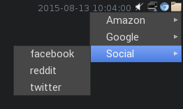

# passtray

[](https://travis-ci.org/marcusolsson/passtray)
[](https://godoc.org/github.com/marcusolsson/passtray)
[](LICENSE)

systray for the UNIX password manager

Select a password through the menu to make it available as a clipboard selection. Runs `pass XXX/zzz -c` when you click an item.

__Note:__ Currently only works when you have the GPG agent configured. 



## Installation

```bash
go get -u github.com/marcusolsson/passtray
```
